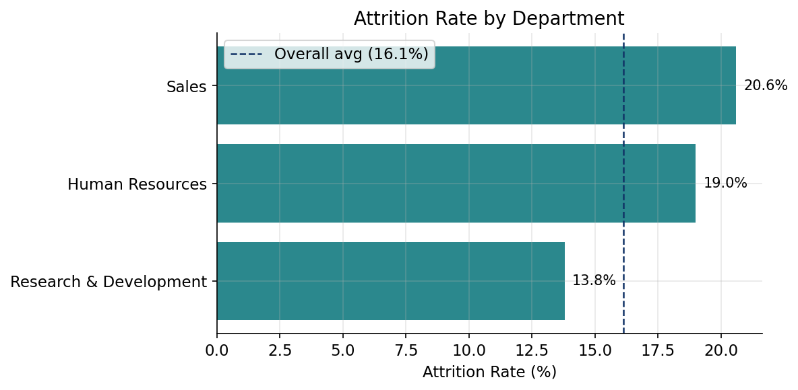
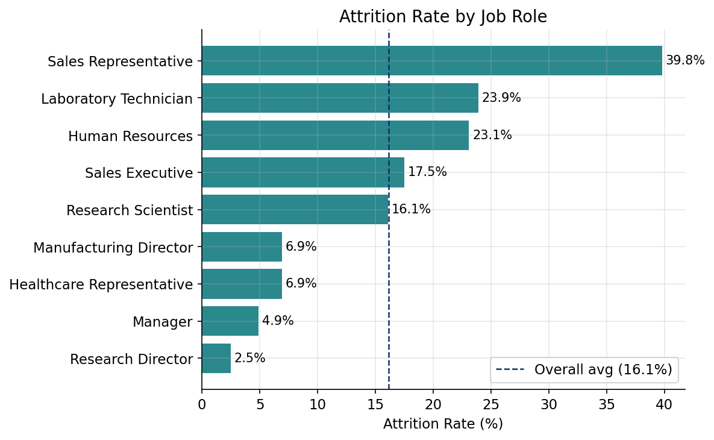
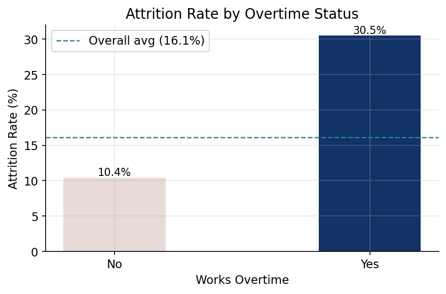
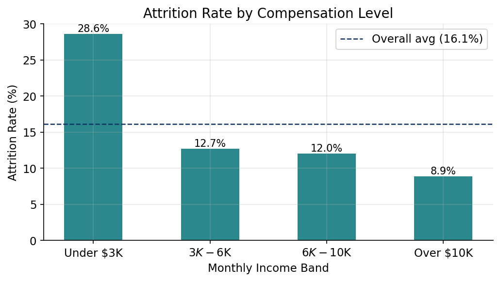
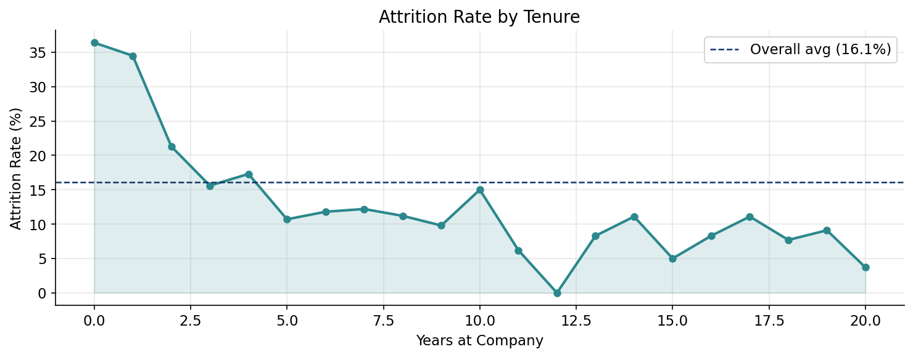
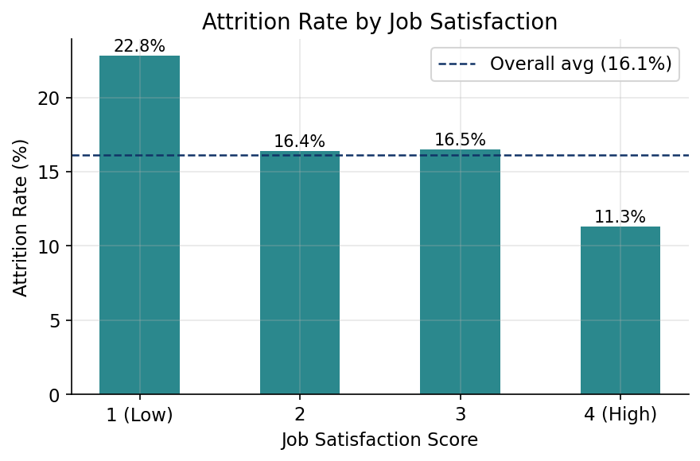

# People Analytics: Understanding Employee Attrition

**Tools:** SQL (PostgreSQL) · Python (pandas, matplotlib) · Tableau  
**Dataset:** [IBM HR Analytics Employee Attrition Dataset](https://www.kaggle.com/datasets/pavansubhasht/ibm-hr-analytics-attrition-dataset) — Kaggle  
**Author:** Thao Le

---

## Business Context

High employee turnover affects workforce stability, team productivity, and hiring costs across every industry. For large organizations managing hundreds or thousands of employees, understanding *why* people leave is just as important as knowing *that* they left.

This project simulates a People Analytics engagement where HR leadership needs data-driven insights to prioritize retention efforts. The goal is to move beyond surface-level reporting and identify the specific drivers of attrition so HR Business Partners can bring actionable recommendations to managers and leadership.

The IBM HR Analytics dataset contains 1,470 employee records with 35 features including compensation, tenure, satisfaction scores, and workload data. It is a smaller, manageable dataset well-suited for exploratory analysis, and serves as a realistic proxy for the kind of workforce data a People Analytics team would work with.

---

## Project Structure

```
people-analytics-attrition/
├── data/
│   └── hr_attrition.csv              
├── sql/
│   └── 01_stakeholder_queries.sql    
├── notebooks/
│   └── hr_attrition_eda.ipynb        
├── visuals/
│   ├── dept_attrition.png
│   ├── role_attrition.png
│   ├── overtime_attrition.png
│   ├── income_attrition.png
│   ├── tenure_attrition.png
│   └── satisfaction_attrition.png
└── README.md
```

---

## Methodology

This analysis follows a structured approach that mirrors how a People Analytics team would respond to a real stakeholder request:

1. **Requirement gathering** — Translated HR leadership's business questions into specific analytical queries
2. **Data quality assessment** — Checked for nulls, duplicates, and low-variance columns before analysis
3. **SQL exploration** — Answered stakeholder questions directly using structured queries in PostgreSQL
4. **Python EDA** — Deeper pattern analysis with visualizations across compensation, engagement, tenure, and workload dimensions
5. **Tableau dashboard** — Executive-facing summary built for non-technical stakeholders
6. **Business recommendations** — Findings translated into prioritized, actionable next steps

---

## SQL Analysis

Five stakeholder questions were addressed in [`01_stakeholder_queries.sql`](sql/01_stakeholder_queries.sql). All queries were written using CTEs for readability and compatibility with Snowflake and MS SQL Server environments.

| # | Business Question | Requested By |
|---|---|---|
| 1 | Which departments and job roles have the highest attrition? | HR Business Partners |
| 2 | Does overtime correlate with employees leaving? | Total Rewards |
| 3 | Are employees without recent promotions more likely to leave? | Talent Development |
| 4 | How does compensation level relate to attrition risk? | Total Rewards & Compensation |
| 5 | Who are our highest-flight-risk active employees? | HR Leadership |

Query 5 builds a flight risk score for each active employee based on five factors: overtime status, years since last promotion, job satisfaction score, monthly income, and tenure. Each factor is worth one point, and any employee scoring 3 or higher is flagged for proactive manager outreach.

One intentional design choice here: the income threshold for the risk score was set at $5,000 rather than $3,000. While our compensation analysis showed the sharpest attrition spike below $3K, the watchlist is meant to be proactive, so casting a slightly wider net makes sense. The goal is to flag employees before they reach the tipping point, not after.

This logic produced a watchlist of **161 active employees** with elevated risk, giving HR Business Partners a concrete starting point for outreach conversations.

---

## Python EDA

Full analysis in [`hr_attrition_eda.ipynb`](notebooks/hr_attrition_eda.ipynb).

### Overall Attrition Rate

The overall attrition rate is **16.1%**. That is the baseline we measure everything else against throughout this analysis.

---

### Attrition by Department



Sales has the highest departmental attrition at 20.6%, followed closely by Human Resources at 19.0%. Research and Development is the only department sitting below the overall average at 13.8%. This tells us retention efforts should be prioritized in Sales and HR first.

---

### Attrition by Job Role



Sales Representatives stand out significantly at **39.8%** — nearly 2.5x the overall average. Laboratory Technicians (23.9%) and Human Resources staff (23.1%) follow. On the other end, Research Directors have the lowest attrition at just 2.5%, and Managers across all departments are consistently below average. The pattern suggests that individual contributor roles, especially in Sales, carry the most retention risk.

---

### Overtime vs Attrition



This is one of the clearest findings in the dataset. Employees working overtime leave at **30.5%** compared to just **10.4%** for those who do not — nearly a 3x difference. Overtime is not just correlated with attrition, it is one of the strongest individual predictors we found. Before assuming this is purely a compensation issue, it is worth investigating whether overtime reflects understaffing, poor workload distribution, or seasonal demand patterns.

---

### Attrition by Compensation Level



There is a clear inverse relationship between pay and attrition. Employees earning under $3K per month leave at **28.6%**, which is more than three times the rate of employees earning over $10K (8.9%). What is also notable is that the $3K-$6K and $6K-$10K bands are nearly identical at 12.7% and 12.0%, suggesting the most critical threshold is that under $3K band. That is where compensation becomes a real flight risk.

---

### Attrition by Tenure



Attrition peaks sharply in years 0 and 1, then drops and largely stays below the overall average after year 4. This tells us the first two years are the highest-risk window. If we can keep employees engaged and supported through that early period, long-term retention improves significantly. Onboarding quality and early career development programs are likely the highest-leverage investments here.

---

### Attrition by Job Satisfaction



Employees with the lowest satisfaction score (1) leave at **22.8%**, while highly satisfied employees (score 4) leave at just **11.3%**. Scores 2 and 3 sit right around the overall average, which suggests satisfaction only becomes a strong driver at the extremes. Employees who are genuinely disengaged are at real risk, while moderate satisfaction does not seem to move the needle much either way.

---

## Tableau Dashboard

📊 **[View Interactive Dashboard on Tableau Public →](#)**

The dashboard gives HR Business Partners and leadership an interactive view of the key findings without needing to run any code. It includes attrition by department and role, the overtime risk breakdown, and the tenure curve — all filterable by department.

---

## Key Findings

| Finding | Attrition Rate | Overall Average |
|---|---|---|
| Sales Representatives | 39.8% | 16.1% |
| Employees working overtime | 30.5% | 16.1% |
| Employees earning under $3K/month | 28.6% | 16.1% |
| Employees in year 0-1 of tenure | 35%+ | 16.1% |
| Employees with job satisfaction score of 1 | 22.8% | 16.1% |

---

## Business Recommendations

Based on this analysis, here is how I would prioritize retention efforts:

**Immediate (0-3 months)**

Start with Sales Representatives. At 39.8% attrition, this role is losing nearly 4 in 10 employees and warrants a dedicated review. I would recommend HR Business Partners conduct structured stay interviews with current Sales Reps to understand what is driving dissatisfaction, and pair that with a compensation benchmarking review to see how salaries compare to market.

Audit overtime. The 3x attrition multiplier for overtime workers is too significant to ignore. The first step is understanding the root cause — is this a staffing gap, a manager issue, or a structural workload problem? The answer determines the solution.

**Short-term (3-6 months)**

Address early tenure attrition. Years 0-2 are clearly the highest-risk window. A structured 30-60-90 day check-in process for new hires, paired with stronger onboarding, would help catch disengagement early before it becomes a departure.

Use the flight risk watchlist. The 161 employees flagged in Query 5 give HR Business Partners a concrete place to start. Prioritize the score-4 employees first and bring the list to managers for proactive conversations.

**Longer-term (6-12 months)**

Build a recurring attrition monitoring dashboard so HR leadership can track these metrics monthly rather than running a one-time analysis. Establish a promotion and career pathing review cycle, particularly for employees who have been in the same role for 3 or more years.
